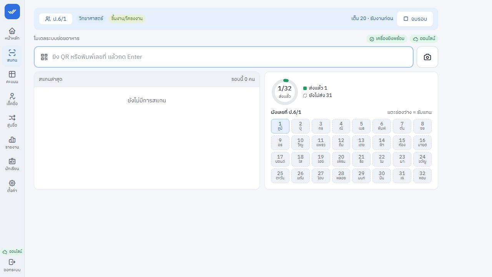

# ผลแก้บั๊กจากไฟล์ Cloud — 30 กันยายน 2569

ใช้ `teacher-ce751ea.zip` เป็นฐานรุ่นล่าสุด นำซอร์สจากไฟล์นี้เข้ามาที่ workspace แล้วแก้ต่อ ไม่ใช้ซอร์สเก่าบนเครื่องเป็นฐาน เก็บสำเนาก่อนแก้ไว้สำหรับเทียบผล รายงานตรวจเดิมบันทึกอาการก่อนแก้ ส่วนไฟล์นี้บันทึกผลหลังแก้

## บั๊กที่ปิดแล้ว

| ข้อ | การแก้และพฤติกรรมหลังแก้ | หลักฐาน |
|---|---|---|
| N01 Undo ทำให้คะแนนเกินคะแนนเต็ม | ตรวจคะแนนเต็มปัจจุบันทั้งก่อนและภายในธุรกรรมของ undo กรณี 9/10 → ล้าง → ลดเต็มเป็น 5 → undo ตอบ `409 full_score_changed` ไม่สร้างคะแนน 9/5 และไม่ลงประวัติว่ากู้คืนสำเร็จ คะแนนเต็มเพิ่มขึ้นแล้วยัง undo ได้ตามปกติ | `test/api/final-audit.test.ts` |
| N02 Undo คืนค่าก่อนหน้าผิดเมื่ออีกเครื่องเขียนคั่น | ตรวจค่าจริงของทุกช่องที่เกี่ยวข้องในธุรกรรมเดียวกับการเขียนและบันทึกประวัติ เมื่อ bulk อ่าน 5 แต่อีกเครื่องเขียน 7 ก่อน bulk เริ่มเขียน จะตอบ `409 modified_since` ทั้งชุดไม่ถูกเขียน ให้โหลดใหม่แล้วทำซ้ำ จากนั้น undo คืน 7 ตรวจพบแม้ timestamp ของสองครั้งเท่ากัน | `test/api/final-audit.test.ts` |
| N03 หน้าสแกนพลาดข้อมูลที่บันทึกคั่นระหว่างการดึงข้อมูล | API ส่ง snapshot ของงานทั้งชุด การ refresh ไม่ใช้เวลาเป็น cursor อีกต่อไป คำตอบเก่าที่มาถึงทีหลังไม่ทับคำตอบใหม่ และไม่ทับการรับงานในเครื่องที่เกิดระหว่างรอคำตอบ รายการรอส่งยังแสดงทับข้อมูลเซิร์ฟเวอร์จนส่งสำเร็จ | `test/api/submissions.test.ts`, `test/unit/scan-controller.test.ts` |
| N04 ให้คะแนนแล้วเปลี่ยนเวลารับงานครั้งแรกจนกลายเป็นส่งช้า | คำขอคะแนนตรวจข้อมูลก่อนเขียนซ้ำในธุรกรรม หากมีการรับงานคั่นจะอ่านและคำนวณใหม่ เก็บเวลารับครั้งแรกและสถานะส่งช้าของการรับครั้งนั้นไว้ ประวัติก่อน/หลังตรงกับข้อมูลที่ถูกเขียนจริง | `test/api/final-audit.test.ts` |

การเขียนคะแนนที่ชนกันต่อเนื่องลองใหม่ได้สูงสุด 3 ครั้ง หากยังชนจะตอบ `503 write_busy` รายการอยู่ในคิวและส่งใหม่ภายหลัง ไม่ทิ้งงานหรือสร้างประวัติว่าบันทึกแล้ว มี API test และ `test/unit/outbox-order.test.ts` ยืนยัน

## แก้ชุดทดสอบที่ล้ม

- Service worker อ่าน body ของหน้า shell ผ่าน `arrayBuffer()` ก่อนสร้าง response ใหม่ ชุดทดสอบออฟไลน์ผ่าน
- ทดสอบส่งออก Excel ยังคงอ่านไฟล์กลับและตรวจข้อมูลจริง เพิ่มเวลาสำหรับการโหลด ExcelJS ครั้งแรกเป็น 15 วินาที ป้องกันการล้มจาก cold import เมื่อรันหลายไฟล์พร้อมกัน

## ผลตรวจรุ่นหลังแก้

| การตรวจ | ผล |
|---|---|
| ทดสอบ regression ใหม่กับรุ่นก่อนแก้ | พบ 7 ข้อล้ม ยืนยันว่าทดสอบตรวจจับอาการเดิมได้ |
| `npm test` หลังแก้ทั้งหมด | **449/449 ผ่าน — 38/38 ไฟล์** |
| `npm run typecheck` | ผ่าน |
| `npm run build` | ผ่าน มีคำเตือน chunk/import เดิมจาก bundler |
| หน้าจอจาก build หลังแก้ บนฐานข้อมูลสมมติแยกต่างหาก | ตารางคะแนนแสดงข้อมูลได้ หน้าตั้งค่าแสดงออฟไลน์พร้อม รับงานผ่านผังเลขที่สำเร็จ และโหลดแอปใหม่แล้วยังเป็นส่งแล้ว 1/32 ไม่มีคิวค้าง |
| `node scripts/preflight.cjs --built` | หยุดที่ `database_id` เป็น placeholder ตามไฟล์ Cloud ไม่ใช่ฐานข้อมูลจริง |

ชุดทดสอบทั้งหมดรวมการเขียนพร้อมกัน การกู้คืนฐานข้อมูล คิวออฟไลน์ และข้อมูลจำลอง 200 นักเรียน/40 งาน ไม่เปลี่ยน schema และไม่ต้องเพิ่ม migration สำหรับการแก้รอบนี้ ไม่แก้ฐานข้อมูลหรือข้อมูลนักเรียนจริง

การ refresh หน้าสแกนอ่านงานทั้งชุดเพื่อป้องกันข้อมูลตกหล่น การทดสอบปริมาณข้อมูลผ่าน แต่จำนวน reads บน Cloud ขึ้นกับการใช้งานจริง ค่าประเมินโควตาของรุ่นก่อนแก้ไม่ใช่ผลวัดของรุ่นนี้

**ติดตามผล (รอบถัดมา):** วัดที่ข้อมูลขนาดโรงเรียน (งานมอบ 5 ห้อง × 40 คน) การอ่านหนึ่งครั้งได้ 205 แถว เทียบกับ 1 แถวของแบบ "เปลี่ยนตั้งแต่เวลาที่แล้ว" เมื่อไม่มีอะไรเปลี่ยน
ที่ทุก 20 วินาที หน้าสแกนที่เปิดค้าง 3 เครื่อง × 6 ชั่วโมงอ่านราว 664,000 แถว (~13% ของโควตาอ่านรายวัน) จึงปรับเป็น **ทุก 60 วินาที เฉพาะตอนที่เห็นหน้าจอ และอ่านทันทีเมื่อกลับมาที่หน้าสแกนหรือเน็ตกลับมา**
(ห่างจากการอ่านครั้งก่อนอย่างน้อย 10 วินาที) — เหลือราว 221,000 แถว (~4.4%) การรับงาน/ส่งคิวไม่ได้รอการอ่านนี้ ข้อมูลของเครื่องอื่นอาจล่าช้าได้ไม่เกิน 1 นาที
ซึ่งเซิร์ฟเวอร์ยังรักษาการรับครั้งแรกไว้เสมอ (N04) มี test ยืนยันความถี่และการกลับมาหลังพักหน้าจอ/เน็ตขาด 5 นาที (`test/unit/scan-controller.test.ts`)

## ไฟล์ส่งมอบและการขึ้น Cloud

ซอร์สแก้แล้วอยู่ใน workspace และแพ็กเป็น `artifacts/teacher-fixed-2026-09-30.zip` โดยไม่รวม dependency, build, ฐานข้อมูล, cache หรือไฟล์ secrets

ภาพหลังโหลดแอปใหม่ (นักเรียนและข้อมูลสมมติ):

งานแก้ N01–N04 และแก้ชุดทดสอบเสร็จแล้ว **ยังไม่ได้ deploy หรือทดสอบกับฐานข้อมูล Cloud จริง** ก่อนนำขึ้นให้ใส่ `database_id` ของฐานเดิม ตรวจ secrets ตาม `docs/OPERATIONS.md` และใช้ขั้นตอน preflight/health check ที่มีอยู่ หลังขึ้นรุ่นใหม่ให้ทดลองกล้อง เครื่องยิง และออฟไลน์บนอุปกรณ์ที่ครูใช้จริงตาม `docs/TRIAL.md`
